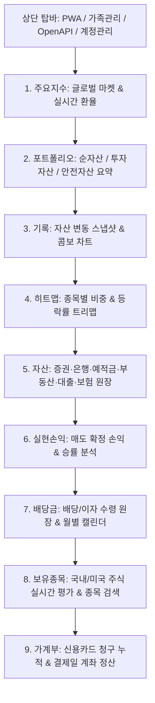

# 📊 내 자산 대시보드 (Wealth)

<div align="center">


**멀티 유저 데이터 완전 격리 · 5대 증권사 OpenAPI 원클릭 연동 · 실시간 시세/환율 · 신용카드 청구/정산 가계부 · 부동산 및 배당/손익 정밀 관리 통합 자산 관리 플랫폼**

</div>

---

## 📑 목차
- [✨ 전체 대시보드 구조 및 개요](#-전체-대시보드-구조-및-개요)
- [🧭 상단 내비게이션 바(Topbar) 버튼 상세 가이드](#-상단-내비게이션-바topbar-버튼-상세-가이드)
- [📊 9대 핵심 섹션 상세 및 모든 버튼 기능 해설](#-9대-핵심-섹션-상세-및-모든-버튼-기능-해설)
  - [1. 주요지수 (MARKET OVERVIEW)](#1-주요지수-market-overview)
  - [2. 포트폴리오 (PORTFOLIO OVERVIEW)](#2-포트폴리오-portfolio-overview)
  - [3. 기록 (ASSET RECORDS)](#3-기록-asset-records)
  - [4. 히트맵 (ASSET HEATMAP)](#4-히트맵-asset-heatmap)
  - [5. 자산 (ASSET ACCOUNTS & PROPERTIES)](#5-자산-asset-accounts--properties)
  - [6. 실현손익 (REALIZED PROFIT & LOSS)](#6-실현손익-realized-profit--loss)
  - [7. 배당금 (DIVIDEND & INTEREST INCOME)](#7-배당금-dividend--interest-income)
  - [8. 보유종목 (STOCK HOLDINGS)](#8-보유종목-stock-holdings)
  - [9. 가계부 (HOUSEHOLD LEDGER)](#9-가계부-household-ledger)
- [👥 멀티 유저 격리 시스템 & 관리자 권한](#-멀티-유저-격리-시스템--관리자-권한)
- [⚙️ 웹 UI를 통한 5대 증권사 OpenAPI 설정 & 삭제](#️-웹-ui를-통한-5대-증권사-openapi-설정--삭제)
- [📂 엑셀 / CSV 파일 일괄 가져오기](#-엑셀--csv-파일-일괄-가져오기)
- [🎨 화면 테마 설정 & 데이터 백업/복원](#-화면-테마-설정--데이터-백업복원)
- [🖥️ Windows 설치 및 실행 방법](#️-windows-설치-및-실행-방법)
- [🐧 Linux / Docker 설치, 실행 및 업데이트 방법](#-linux--docker-설치-실행-및-업데이트-방법)
- [🛡️ 보안 및 개인정보 보호 원칙](#️-보안-및-개인정보-보호-원칙)

---

## ✨ 전체 대시보드 구조 및 개요

본 대시보드는 **주요지수 ➔ 포트폴리오 ➔ 기록 ➔ 히트맵 ➔ 자산 ➔ 실현손익 ➔ 배당금 ➔ 보유종목 ➔ 가계부**의 총 9대 핵심 섹션으로 구성되어 있으며, 모든 금융 데이터(주식, 예적금, 부동산, 대출, 보험, 카드 가계부)를 하나의 유기적인 화면에서 실시간으로 추적·관리합니다.



---

## 🧭 상단 내비게이션 바(Topbar) 버튼 상세 가이드

화면 최상단 헤더(Topbar)에 배치된 핵심 전역 제어 버튼들의 기능과 역할입니다:

| 버튼명 | 아이콘 / UI 형태 | 기능 및 상세 설명 |
| :--- | :---: | :--- |
| **PWA 앱 설치** | `📱 앱 설치` | 브라우저(Chrome, Edge, Safari) 환경에서 클릭 시, 별도의 스토어 설치 없이 **데스크톱 및 스마트폰 홈 화면에 독립형 네이티브 앱(PWA)**으로 즉시 설치합니다. |
| **사용자 프로필** | `👤 sagesaint` | 현재 로그인 중인 사용자 아이디를 표시합니다. 멀티 유저 환경에서 데이터가 해당 사용자 전용 폴더(`data/users/{username}/`)에 안전하게 격리되어 있음을 나타냅니다. |
| **가족 구성원 관리** | `👨‍👩‍👧‍👦 가족` | 클릭 시 **가족 구성원 설정 모달**이 열립니다. `아빠`, `엄마`, `자녀` 등 가족 구성원을 등록/수정/삭제할 수 있으며, 등록된 구성원은 모든 섹션의 **소유자 탭 버튼**으로 자동 연동됩니다. |
| **시스템 관리자 콘솔** | `⚙️ 사용자 관리` | **`admin` 계정 전용 버튼**. 클릭 시 신규 사용자 아이디 생성, 초기 비밀번호(4자리) 발급, 비밀번호 강제 초기화, 계정 삭제 등을 수행할 수 있는 관리자 모달이 열립니다. |
| **증권사 OpenAPI 설정** | `⚙️ OpenAPI` | **5대 증권사(토스, KB, NH투자, 한국투자증권, 키움증권)**의 OpenAPI AppKey, AppSecret, 계좌번호를 웹 화면에서 직접 입력하고 안전하게 저장/삭제할 수 있는 모달을 엽니다. |
| **비밀번호 변경** | `🔑 비번 변경` | 현재 로그인된 계정의 비밀번호를 안전하게 변경할 수 있는 모달을 엽니다. (기존 비밀번호 확인 후 새 비밀번호 저장) |
| **로그아웃** | `로그아웃` (붉은색) | 현재 브라우저 세션 쿠키를 안전하게 파기하고 로그인 화면(`/login`)으로 이동합니다. |

---

## 📊 9대 핵심 섹션 상세 및 모든 버튼 기능 해설

---

### 1. 주요지수 (MARKET OVERVIEW)
글로벌 금융 시장의 대표 지수와 실시간 원/달러 환율 및 비트코인 시세를 한눈에 파악하는 상단 마켓 오버뷰 섹션입니다.

* **표시 지표**:
  * 🇰🇷 **코스피 (KOSPI)**, **코스닥 (KOSDAQ)**
  * 🇺🇸 **S&P 500**, **나스닥 100 (NASDAQ 100)**, **다우존스 (Dow Jones)**, **필라델피아 반도체 (SOX)**
  * 🪙 **비트코인 (BTC/KRW)**, 💵 **원/달러 환율 (USD/KRW)**
* **섹션 내부 버튼 및 컨트롤**:
  * **기간 선택 탭 (`일간 1D` / `주간 1W` / `월간 1M` / `연간 1Y` / `전체 ALL`)**: 클릭 시 선택한 기간 동안의 각 지수별 등락률(%)과 전일/전주/전월 대비 증감액을 실시간으로 전환 계산하여 표시합니다.
  * **`🔄 시세 갱신` (우측 툴바)**: 네이버페이 증권 및 야후 파이낸스, 실시간 웹 환율 API를 병렬 호출하여 전체 보유종목의 현재가와 시장 지수, 환율을 즉시 새로고침합니다.
  * **`🔄 동기화` (우측 툴바)**: 설정된 증권사(토스, KB, 나무, 한투, 키움) OpenAPI를 일괄 호출하여 계좌 잔고 및 보유 주식 수량을 최신 상태로 동기화합니다.
  * **`▼ 접기/펼치기`**: 주요지수 패널 본문을 접거나 펼쳐 화면 공간을 효율적으로 활용할 수 있습니다. (접힘 상태는 브라우저에 자동 기억)

---

### 2. 포트폴리오 (PORTFOLIO OVERVIEW)
총자산, 부채, 순자산, 총 투자자산, 누적 실현손익, 총 배당금 및 안전자산을 한 화면에서 일목요연하게 조망하는 핵심 대시보드 허브입니다.

* **소유자 필터 탭 (`모두` / `아빠` / `엄마` / `자녀` ...)**:
  * 탭을 클릭하면 포트폴리오 요약뿐만 아니라 **대시보드 전체 섹션의 자산 데이터가 해당 소유자의 자산으로 일괄 필터링**됩니다.
* **핵심 요약 카드 6종**:
  1. **순자산**: 총자산(투자자산+안전자산)에서 총부채를 뺀 순수 자산. 하단에 `총부채 -₩0`(푸른색 음수) 표시.
  2. **총 투자자산**: 순수 투자 목적으로 운용되는 자산. `부동산(자가/임대 시세 100% 반영)` + `주식 평가액`.
  3. **총 수익 & 일간 수익**: 총 평가손익 및 수익률(%), 하단에 전일 대비 `일간 수익 ₩0 (+0.00%)` 실시간 표시.
  4. **총 실현손익**: All-Time 누적 매도 실현손익 + 세로로 정렬된 당해 연도(`26년`) 및 당월(`09월`) 실현손익.
  5. **총 배당금 및 이자**: 누적 배당/이자 수령 총액 + 세로로 정렬된 당해 연도(`26년`) 및 당월(`09월`) 배당금.
  6. **안전자산 (🛡️)**: 비투자성 유동성 자산 총액. 하단에 `예수금 및 예금`, `임차보증금(전세보증금)`, `보험(해약환급금)` 세부 내역 표시.
* **투자자산 분류 (우측 열)**:
  * **도넛 차트**: 자산군별(국내주식, 미국주식, 부동산 등) 또는 섹터별(반도체, 빅테크, 배당 등) 비중 시각화.
  * **분류 리스트**: 각 분류별 평가금액 및 전체 투자자산 대비 비중(%) 표시.
* **`▼ 접기/펼치기`**: 포트폴리오 섹션을 접거나 펼칩니다.

---

### 3. 기록 (ASSET RECORDS)
시간 경과에 따른 순자산, 총자산, 투자자산, 부채의 변화 추이를 스냅샷으로 기록하고 장기 성장 곡선을 분석하는 섹션입니다.

* **뷰 전환 탭**:
  * **`📈 콤보 차트`**: 순자산 추이를 선(Line) 그래프로, 총자산/투자자산/부채를 막대(Bar) 그래프로 결합하여 입체적으로 표시.
  * **`📊 막대 차트`**: 자산 구성 요소별 변화를 순수 막대 그래프로 정렬.
* **기간 선택 탭 (`일간 1D` / `주간 1W` / `월간 1M` / `연간 1Y` / `전체 ALL`)**: 조회 기간을 필터링합니다.
* **툴바 버튼**:
  * **`➕ 기록 추가`**: 과거 특정 날짜의 자산/부채 금액을 수기로 입력하여 과거 기록을 보완합니다.
  * **`💾 현재 자산 기록`**: 오늘 현재 시점의 대시보드 계산 결과(순자산, 총자산, 투자자산, 부채)를 **원클릭으로 즉시 스냅샷 저장**합니다.
  * **`▼ 접기/펼치기`**: 기록 섹션을 접거나 펼칩니다.
* **기록 목록 테이블**:
  * 등록된 날짜별 자산 스냅샷, 전회 대비 변동액(증감), `✎ 수정` 및 `🗑️ 삭제` 버튼 제공.

---

### 4. 히트맵 (ASSET HEATMAP)
보유 중인 주식 및 ETF의 비중 크기와 수익률 등락을 직관적인 컬러 맵으로 시각화하여 포트폴리오 건전성을 한눈에 점검하는 섹션입니다.

* **뷰 모드 탭**:
  * **`트리맵 (Treemap)`**: 각 종목의 평가금액 크기에 비례하여 사각형 블록 크기를 결정하고, 수익률에 따라 색상 농도를 입혀 시각화합니다.
  * **`카드 (Cards)`**: 모든 종목을 일정한 카드 그리드 형태로 나열하여 확인합니다.
* **기간 탭 (`1일 1D` / `1주 1W` / `1달 1M` / `1년 1Y` / `전체 ALL`)**: 해당 기간 동안의 수익률 등락폭을 색상에 반영합니다.
* **색상 테마 탭**:
  * **`한국식`**: 상승 종목은 🔴 붉은색, 하락 종목은 🔵 푸른색으로 표시.
  * **`미국식`**: 상승 종목은 🟢 초록색, 하락 종목은 🔴 붉은색으로 표시.
* **`▼ 접기/펼치기`**: 히트맵 섹션을 접거나 펼칩니다.

---

### 5. 자산 (ASSET ACCOUNTS & PROPERTIES)
보유한 증권사 계좌, 은행 자유입출금 통장, 예·적금/청약, 부동산(자가/임대/임차), 대출/부채, 보험 등 모든 자산 원장을 통합 관리하는 섹션입니다.

* **하위 자산 탭**:
  * **`전체 자산`**: 모든 금융 및 실물 자산, 부채 목록 통합 조회.
  * **`증권 계좌`**: 주식 및 ETF를 보유 중인 위탁 계좌 (토스, KB, 나무, 한투, 키움 및 직접 등록 계좌).
  * **`은행 계좌`**: 수시입출금 은행 통장 및 파킹통장 잔액 관리.
  * **`예·적금`**: 정기예금, 자유적금, 주택청약종합저축 (적용 금리, 만기일, 청약 만기없음 옵션 지원).
  * **`부동산`**: 자가 아파트/주택, 임대(전월세 준 집 - 보증금 부채 자동 차감), 임차(전월세 들어간 집 - 보증금 자산 반영) 및 KB부동산 시세 연동.
  * **`대출/부채`**: 주택담보대출, 신용대출, 마이너스통장 잔액 관리.
  * **`보험`**: 월 납입 보험료 및 해약환급금(안전자산) 관리.
* **툴바 버튼**:
  * **`➕ 자산 추가`**: 새로운 계좌, 예적금, 부동산, 대출, 보험 상품을 직접 등록하는 모달을 엽니다.
  * **`▼ 접기/펼치기`**: 자산 섹션을 접거나 펼칩니다.
* **각 자산 항목별 제어**:
  * `✎ 수정`: 잔액, 계좌명, 금리, 만기일, 소유자 변경.
  * `🗑️ 삭제`: 등록된 자산 삭제.

---

### 6. 실현손익 (REALIZED PROFIT & LOSS)
주식/ETF/암호화폐 매도를 통해 확정된 실현 수익과 손실을 기록하고 매매 승률 및 성과를 정밀 분석하는 섹션입니다.

* **연도 및 매매구분 필터**:
  * `연도 선택 (전체, 2026년, 2025년...)`
  * `구분 선택 (전체, 국내주식, 해외주식, 공모주, 암호화폐)`
* **핵심 성과 지표**:
  * 총 실현손익 합계, 승률(%), 총 거래 건수, 수익 거래액, 손실 거래액.
  * 월별 실현손익 막대 차트.
* **툴바 버튼**:
  * **`➕ 실현손익 추가`**: 매도 완료된 종목의 매도일자, 종목명(공모주/일반주식 실시간 검색 및 종목코드 자동완성 지원), 실현손익을 입력하여 손익을 수기 등록합니다. (달러 종목은 매도일 당시 환율 자동 적용)
  * **`📤 엑셀 가져오기`**: 증권사에서 다운로드한 매도 실현손익 엑셀/CSV 파일을 일괄 업로드합니다.
  * **`▼ 접기/펼치기`**: 실현손익 섹션을 접거나 펼칩니다.

---

### 7. 배당금 (DIVIDEND & INTEREST INCOME)
국내/미국 주식 및 ETF의 배당금, 분배금과 예적금/채권 이자 수령 내역을 캘린더와 차트로 체계적으로 관리하는 섹션입니다.

* **구분 및 통화 지원**:
  * 국내 배당금(`KRW`), 미국/해외 배당금(`USD` - 지급일 당시 환율 자동 매칭 환산).
  * 현금성 이자 전용 지원: `원화이자`, `달러이자`, `RP이자`, `예탁금이자`.
* **연간/월별 배당 차트 & 12개월 배당 캘린더**:
  * 월별 배당금 수령 현황 바 차트 및 각 월별 입금 예정/완료 캘린더.
* **툴바 버튼**:
  * **`➕ 배당/이자 추가`**: 배당금 또는 이자 수령 내역(지급일, 종목명, 세전/세후 금액, 통화)을 등록합니다.
  * **`📤 엑셀 가져오기`**: 배당금 입금 내역 엑셀 파일을 일괄 업로드합니다.
  * **`▼ 접기/펼치기`**: 배당금 섹션을 접거나 펼칩니다.

---

### 8. 보유종목 (STOCK HOLDINGS)
현재 보유 중인 모든 국내 주식, 미국 주식, ETF의 실시간 평가액, 수익률, 포트폴리오 비중을 상세 테이블로 관리하는 섹션입니다.

* **필터 & 정렬 컨트롤**:
  * **마켓 필터**: `전체`, `국내주식(KR)`, `해외주식(US)`.
  * **정렬 기준 드롭다운**: 평가금액순, 수익률순, 종목명순, 평가손익순 (오름차순/내림차순 토글).
  * **검색창**: 종목코드 또는 종목명 실시간 타이핑 검색.
* **툴바 버튼**:
  * **`➕ 종목 직접 추가`**: 증권사 OpenAPI 외에 타 증권사 보유 종목이나 직접 관리하고 싶은 주식을 수기로 등록합니다. (계좌 지정, 매입가, 수량 입력)
  * **`📂 엑셀 가져오기`**: 보유종목 엑셀 템플릿(`샘플_타증권사_보유종목.xlsx`) 파일을 일괄 업로드합니다.
  * **`▼ 접기/펼치기`**: 보유종목 섹션을 접거나 펼칩니다.
* **테이블 내부 제어**:
  * `📈 종목 차트`: 클릭 시 네이버/야후 실시간 주가 차트 팝업.
  * `✎ 수정` / `🗑️ 삭제`: 보유 수량 및 매입단가 수정 또는 종목 삭제.

---

### 9. 가계부 (HOUSEHOLD LEDGER)
가족 구성원별 수입/지출을 기록하고, **신용카드 사용액 누적 ➔ 결제일 연결계좌 일괄 출금(0원 정산) 시스템**이 완비된 지능형 가계부 섹션입니다.

* **월 이동 컨트롤러 (`◀ 2026년 9월 ▶`)**:
  * 이전 달/다음 달로 이동하며 당월 총수입, 총지출, 저축액, 지출 카테고리별 비중을 조회합니다.
* **툴바 버튼 4종**:
  1. **`💳 카드 관리`**:
     * 신용카드(현대, 삼성, 신한, 국민, 롯데, 우리, 하나 등)를 카드사, 카드명, 소유자, **매월 결제일(1~31일)**, **출금 결제계좌(은행통장)**와 함께 등록/관리합니다.
     * 각 카드별 **당월 미결제 청구 누적액과 이용 건수**를 실시간 집계합니다.
     * **`[💳 결제/정산]` 버튼**: 카드 결제일 도래 시 클릭하면 연결된 은행 계좌에서 카드값이 일괄 출금되고, 가계부에 출금 거래 자동 생성 및 카드 청구액은 **0원으로 깨끗하게 리셋**됩니다.
  2. **`🛡️ 고정지출 관리`**:
     * 매월 정기적으로 지출되는 아파트 관리비, 공과금, 통신비, 구독료, 보험료, 대출이자 등을 등록하고 당월 거래로 자동 발행합니다.
  3. **`📤 엑셀 업로드`**:
     * 은행/카드사에서 다운로드한 지출 내역 엑셀 파일을 일괄 등록합니다.
  4. **`➕ 내역 등록` (핵심 등록 모달)**:
     * **수입(💰)** 선택 시: 불필요한 결제수단 필드를 숨기고 `입금 연동 계좌`만 표시. (저장 시 선택한 은행 통장 잔액 증가)
     * **지출(💳)** 선택 시:
       * `신용카드`: 지출 등록 즉시 은행 잔액을 깎지 않고 **해당 카드의 당월 청구액으로 누적 모음**.
       * `체크카드 / 계좌출금`: 출금 은행 계좌 선택 ➔ 등록 즉시 실제 은행 잔액 실시간 차감.
       * **실시간 잔액 변동 프리뷰**: 계좌 선택 및 금액 입력 시 하단에 `기존 잔액 ➔ 적용 후 예상 잔액`을 실시간 계산하여 표시.
  5. **`▼ 접기/펼치기`**: 가계부 섹션을 접거나 펼칩니다.

---

## 👥 멀티 유저 격리 시스템 & 관리자 권한

본 대시보드는 1대의 서버/PC에서 여러 사용자가 각자의 독립된 자산을 관리할 수 있는 **멀티 유저 통합 격리 아키텍처**를 제공합니다.

### 1. 계정 체계
| 구분 | 아이디 예시 | 역할(Role) | 화면 구성 | 접근 권한 |
| :--- | :--- | :---: | :--- | :--- |
| **시스템 관리자** | `admin` | `admin` | **사용자 계정 관리 전용 콘솔** | 사용자 목록 조회, 신규 아이디 추가, 비밀번호 4자리 초기화, 계정 삭제 |
| **일반 사용자** | `sagesaint`, `family` 등 | `user` | **개인 투자 자산 대시보드** | 본인 자산/배당/손익/가계부 조회, 개별 OpenAPI 키 관리, 본인 비밀번호 변경 |

### 2. 관리자(Admin) 콘솔 사용 방법
1. 브라우저에서 `admin` 계정으로 로그인합니다. (최초 로그인 시 비밀번호 강제 변경 필수)
2. 자산 화면 대신 **사용자 관리 화면**이 메인으로 표시됩니다.
3. **새 사용자 추가**: 아이디와 초기 비밀번호 4자리를 입력하여 생성합니다.
4. **비밀번호 초기화**: 사용자가 비밀번호를 잊었을 때 임의의 4자리 비밀번호로 초기화합니다.
5. **사용자 삭제**: 계정 삭제 시 해당 유저의 폴더(`data/users/{username}/`)도 함께 안전하게 정리됩니다.

---

## ⚙️ 웹 UI를 통한 5대 증권사 OpenAPI 설정 & 삭제

소스코드나 설정 파일을 직접 열지 않고도 웹 화면에서 안전하게 OpenAPI 인증키를 관리할 수 있습니다:

1. 로그인 후 상단 헤더 우측의 **`[⚙️ OpenAPI]`** 버튼을 클릭합니다.
2. 지원 증권사:
   * 🟦 **토스증권 (Toss)**: Client ID, Client Secret
   * 🟨 **KB증권**: App Key, App Secret
   * 🟩 **NH투자증권 (나무)**: App Key, App Secret
   * 🟧 **한국투자증권 (KIS)**: App Key, App Secret, 계좌번호(CANO 8자리 또는 8자리-01)
   * 🟪 **키움증권 (Kiwoom)**: App Key, App Secret, 계좌번호(8자리 또는 8자리-01)
3. 인증키 입력 후 **`[💾 설정 저장]`**을 누르면 사용자 전용 폴더(`data/users/{username}/openapi_config.json`)에 안전하게 저장되며, 화면에는 자동으로 `****` 마스킹 처리됩니다.
4. 연결을 해제하거나 키를 변경하고 싶을 때는 상태 뱃지 옆의 **`[🗑️ 삭제]`** 버튼을 누르면 해당 증권사의 키와 토큰 캐시가 즉시 완전히 초기화됩니다.

---

## 📂 엑셀 / CSV 파일 일괄 가져오기

OpenAPI 미지원 증권사나 과거 거래 내역은 각 섹션의 **`[📂 가져오기]`** / **`[📤 엑셀 가져오기]`** 버튼을 통해 한 번에 등록할 수 있습니다:
1. **`샘플_타증권사_보유종목.xlsx`** (보유종목 가져오기)
2. **`샘플_배당.xlsx`** (배당내역 가져오기 - `원화이자`, `달러이자`, `RP이자` 등 지원)
3. **`샘플_매도실현손익.xlsx`** (매도 실현손익 가져오기)

---

## 🎨 화면 테마 설정 & 데이터 백업/복원

화면 최하단 푸터 영역에서 테마 전환과 전체 데이터 백업을 수행할 수 있습니다:

* **화면 테마 설정 (Theme Switcher)**:
  * 🟣 **퍼플 (시그니처 기본)**: 유려하고 현대적인 네이비/퍼플 글래스모피즘 테마.
  * 🖤 **클래식 다크 (OLED BLACK)**: 배터리 소모를 줄이고 눈의 피로를 최소화하는 깊은 블랙 테마.
  * ⚪ **모던 화이트 (CLEAN WHITE)**: 밝고 화사한 화이트/라이트 모드 테마.
* **데이터 백업 & 복원**:
  * **`💾 데이터 백업 (JSON 다운로드)`**: 본인 계정의 모든 자산, 계좌, 보유종목, 배당, 실현손익, 가계부 데이터를 단일 JSON 파일로 안전하게 백업합니다.
  * **`📂 백업 데이터 복원`**: 이전에 다운로드한 백업 JSON 파일을 업로드하여 데이터를 원상태로 복구합니다.

---

## 🖥️ Windows 설치 및 실행 방법

### 1. 요구사항
- [Python 3.11 이상](https://www.python.org/downloads/) 설치 (`Add Python to PATH` 체크)

### 2. 가상환경 및 패키지 설치
```powershell
# 가상환경 생성 및 활성화
py -m venv .venv
.\.venv\Scripts\Activate.ps1

# 패키지 설치
pip install -r requirements.txt
```

### 3. 대시보드 실행
- **간편 실행**: 프로젝트 폴더의 **`대시보드_실행.cmd`** 파일을 더블클릭합니다.
- **터미널 실행**:
  ```powershell
  python -m uvicorn app.main:app --host 127.0.0.1 --port 4829
  ```
- 브라우저에서 `http://127.0.0.1:4829`로 접속합니다.

---

## 🐧 Linux / Docker 설치, 실행 및 업데이트 방법

```bash
# 1. 저장소 복제 및 이동
git clone https://github.com/sagesaint84/wealth.git
cd wealth

# 2. Docker Compose 빌드 및 실행
docker compose up -d --build

# 3. 최신 버전 업데이트 시 (데이터 보존)
git pull origin main
docker compose up -d --build
```

---

## 🛡️ 보안 및 개인정보 보호 원칙

1. **로컬 우선(Local-First) 원칙**:
   - 모든 자산, 금융 거래 내역 및 OpenAPI 인증키는 사용자의 로컬 환경(`data/users/{username}/`)에만 저장되며 외부 제3자 서버로 절대 전송되지 않습니다.
2. **비밀번호 단방향 암호화**:
   - 모든 사용자 비밀번호는 `bcrypt` 해시 알고리즘으로 안전하게 단방향 암호화되어 관리자조차 원본 비밀번호를 열람할 수 없습니다.
3. **인증키 마스킹 및 독립 세션**:
   - 화면에 표시되는 OpenAPI 키와 계좌번호는 자동으로 마스킹(`****`) 처리되며, 암호화된 세션 쿠키를 통해 안전하게 보호됩니다.
